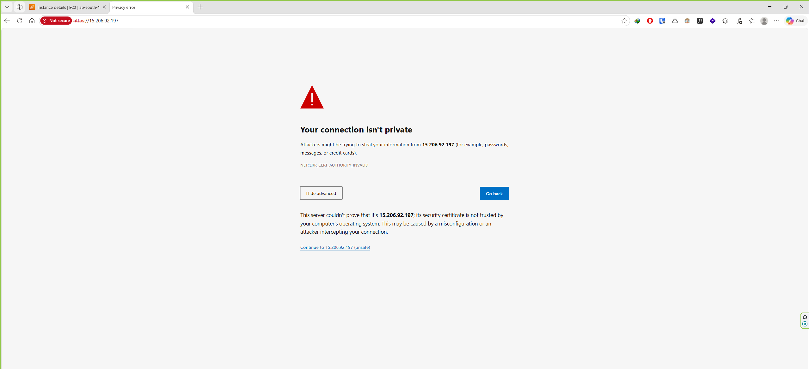
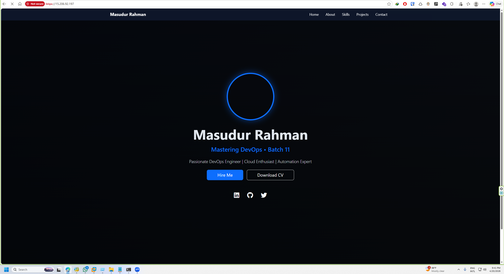
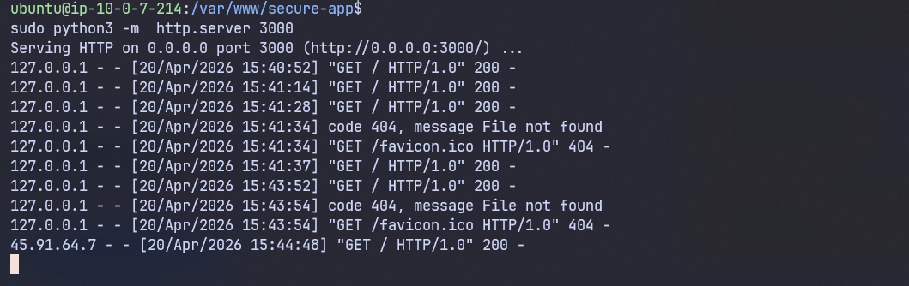
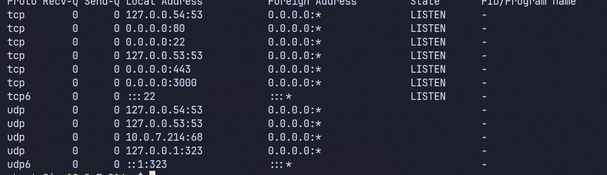

# Ostad_Assignmet_03_Nginx-Web-Server-with-HTTPS-SSL-Reverse-Proxy
## 📖 Overview
This repository demonstrates a secure, production-like Nginx setup on Linux. It includes:
- ✅ Static website hosting
- 🔒 Self-signed SSL/TLS encryption (HTTPS)
- 🔀 Automatic HTTP → HTTPS redirect
- 🔄 Reverse proxy to a backend service on port `3000`


---

## 📦 Step-by-Step Setup

### 🔹 Part 1: Basic Setup
```bash
# Update & install Nginx + OpenSSL
sudo apt update
sudo apt install -y nginx openssl

# Create web root directory
sudo mkdir -p /var/www/secure-app
```
### Create static HTML page in /var/www/secure-app/index.html

```
# Create SSL directory
sudo mkdir -p /etc/nginx/ssl
```
### # Generate self-signed certificate (valid for 365 days)

```
sudo openssl req -x509 -nodes -days 365 -newkey rsa:2048 \
  -keyout /etc/nginx/ssl/nginx-cert.key \
  -out /etc/nginx/ssl/nginx-cert.crt

```
## Nginx Configuration
```
vim /etc/nginx/nginx.conf


worker_processes 1;

events {
    worker_connections 1024;
}


http {
    include /etc/nginx/mime.types;


    #upstream block to define the application
    upstream nodejs_cluster {
        server 127.0.0.1:3000;
    }

    server {
        listen 443 ssl;
        server_name localhost;

        # SSL certificate paths
        ssl_certificate /etc/nginx/ssl/nginx-cert.crt;
        ssl_certificate_key /etc/nginx/ssl/nginx-cert.key;
   

        #server location

        location / {
            proxy_pass http://nodejs_cluster;
            proxy_set_header Host $host;
            proxy_set_header X-Real-IP $remote_addr;
        }
    }

    server {
        listen 80;
        server_name localhost;
        
        #redirect
        location /{
            return 301 https://$host$request_uri;
        }
    }
}

```

## Creating Backend 
```
sudo apt install python3-pip
# starting the server
sudo python3 -m  http.server 3000
```

## Test nginx config
```
sudo nginx -t
```
### Start or reload the ngnix service
```
sudo systemctl start nginx
sudo systemctl reload nginx
```

## Screenshot
### HTTPS redirect



### HTTPS Website


## status of Backend server 



## Port Listening


